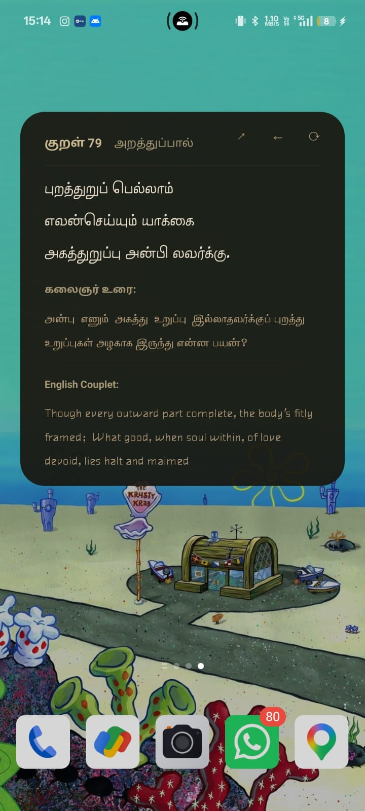
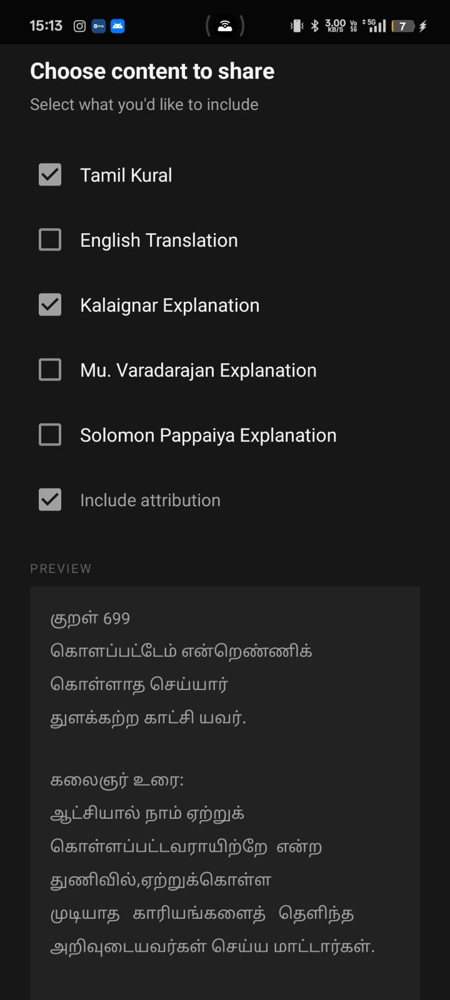
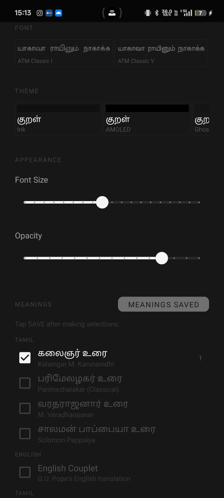
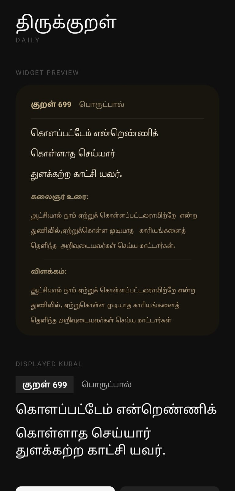
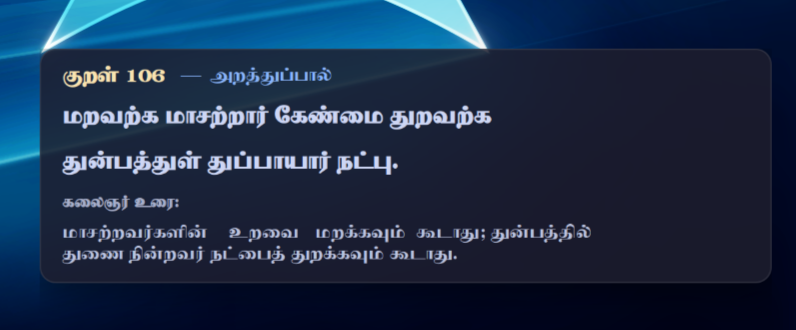

<div align="center">


# Thirukkural Daily Widget

**A beautifully minimal, cross-platform daily Thirukkural widget.**  
One Kural. Every day. All 1330 — beautifully rendered.

[](https://www.gnu.org/licenses/gpl-3.0)
[](https://f-droid.org/packages/com.abezb.thirukuraldaily/)
[](https://github.com/Abez-B/thirukkural-daily-widget-/releases)
[](https://github.com/Abez-B/thirukkural-daily-widget-/stargazers)

</div>

---

<div align="center">
  
</div>

---

## 📸 Screenshots

<table>
  <tr>
    <td align="center"><br/><sub><b>Widget View</b></sub></td>
    <td align="center"><br/><sub><b>Customization</b></sub></td>
    <td align="center"><br/><sub><b>Widget Sizes</b></sub></td>
  </tr>
  <tr>
    <td align="center"><br/><sub><b>Android</b></sub></td>
    <td align="center"><br/><sub><b>Desktop / Windows</b></sub></td>
    <td align="center"><br/><sub><b>Linux</b></sub></td>
  </tr>
</table>

---

## ✨ Features

- 📅 **Daily Kural** — Cycles through all 1330 Kurals over 1330 days using epoch math. No repeats.
- 🎲 **Random Kural** — Tap the shuffle button to explore any Kural, with full back-navigation history.
- 🌙 **Offline First** — Fully functional without any internet connection. No cloud. No trackers.
- 🎨 **Deep Customization** — Choose from 7 hand-crafted monochromatic themes (Ink, AMOLED, Parchment, Stone, Palm Leaf, Ghost, Paper).
- 📐 **Multiple Widget Sizes** — Resizable widgets that gracefully adapt to your home screen layout.
- 🔤 **Native Tamil Typography** — Pristine rendering using the TAU-Kabilar font, with no character blocks.
- 📖 **Expert Commentary** — Read alongside multiple scholarly explanations for each Kural.
- 🔋 **Battery Friendly** — Completely invisible background footprint. Zero wake-locks.
- 🔓 **100% Open Source** — No ads, no telemetry, no proprietary dependencies.

---

## 📱 Platforms

| Platform | Status | Notes |
|---|---|---|
| **Android** | ✅ Stable | Home screen widget with full customization |
| **Linux (Wayland)** | ✅ Stable | `eww` widget for Hyprland / Sway |
| **Linux (X11)** | ✅ Stable | `conky` widget fallback |
| **Windows** | ✅ Stable | Rainmeter skin |

---

## 🚀 Installation

### Android

<a href="https://f-droid.org/packages/com.abezb.thirukuraldaily/">
  
</a>

Or download the latest APK from the [GitHub Releases](https://github.com/Abez-B/thirukkural-daily-widget-/releases) page.

**Setup:**
1. Install the APK.
2. Long-press an empty spot on your home screen → **Widgets**.
3. Find **Thirukkural Daily** and drag it onto your screen.
4. Tap the widget to open the app and customize your theme, font size, and commentary.

---

### 🐧 Linux (Eww / Wayland)

```bash
git clone https://github.com/Abez-B/thirukkural-daily-widget-.git
cd thirukkural-daily-widget-
./install.sh
```

**Requirements:** `python3`, [`eww`](https://github.com/elkowar/eww)

After installing:
```bash
eww daemon && eww open kural
```

> **Hyprland tip:** Add `exec-once = eww daemon && eww open kural` to your `hyprland.conf` to launch on boot.

---

### 🪟 Windows (Rainmeter)

1. Install [Rainmeter](https://www.rainmeter.net/).
2. Download the `.rmskin` from [Releases](https://github.com/Abez-B/thirukkural-daily-widget-/releases).
3. Double-click to install and activate the skin.

---

## 🤝 Contributing

Contributions are warmly welcome!

- 🐛 [Report a bug](https://github.com/Abez-B/thirukkural-daily-widget-/issues)
- 💡 [Request a feature](https://github.com/Abez-B/thirukkural-daily-widget-/issues/new?template=feature_request.md)
- 🔀 [Submit a Pull Request](https://github.com/Abez-B/thirukkural-daily-widget-/pulls)

Please follow the existing project architecture and keep changes minimal and maintainable.

---

## 📄 License

This project is licensed under the **GNU General Public License v3.0**.  
See the [LICENSE](LICENSE) file for details.

---

<div align="center">
  Made with ❤️ by <a href="https://bharath.is-cool.dev/">Bharath</a>
</div>
