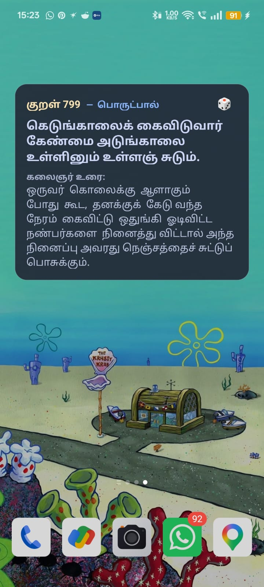
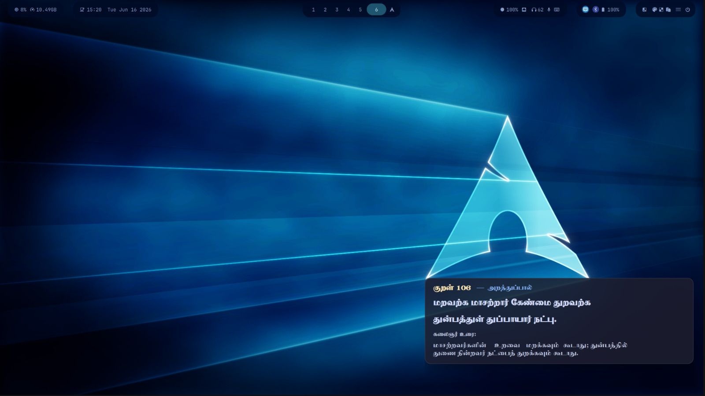

# Thirukkural Daily Widget

A cross-platform daily Thirukkural flashcard widget. Cycles through all 1330 Kurals, showing one perfectly-formatted Kural each day.

<p align="center">
  
  
</p>
## Platforms Supported

1. **Linux (Wayland)**: A stunning, minimal `eww` widget specifically designed for modern compositors like Hyprland/Sway.
2. **Linux (X11)**: A fallback `conky` widget mirroring the Wayland aesthetic.
3. **Android**: A completely "invisible" Android app (no icon in your app drawer) that provides a beautiful Home Screen widget with battery-friendly background updates.

## Features

- **1330-Day Epoch Math**: Cycles through every Kural without repeating.
- **Pure Tamil Typography**: Includes the `TAU-Kabilar` font for native formatting without blocks or weird characters.
- **Kalaignar Urai**: Shows Dr. M. Karunanidhi's explanation tightly wrapped to fit.
- **Interactive**: (Android) Tap the dice 🎲 icon to roll a random Kural, or tap the background to return to today's daily Kural.

---

## 🐧 Linux Installation (Eww / Wayland)

We've provided a simple installer script to copy the python scripts, database, fonts, and Eww configuration into your local directories.

```bash
git clone https://github.com/yourusername/thirukkural-daily.git
cd thirukkural-daily
./install.sh
```

**Requirements**:
* `python3`
* `eww` (Elkowar's Wacky Widgets)

After installing, simply run:
```bash
eww daemon
eww open kural
```
*(If you use Hyprland, add `exec-once = eww daemon && eww open kural` to your `hyprland.conf` to launch it on boot).*

---

## 📱 Android Installation

Because this is a completely background widget, there is no launcher icon.

1. Download the latest `app-debug.apk` from the Releases tab (or build it yourself via Android Studio).
2. Install the APK on your phone.
3. Long-press on an empty spot on your Android Home Screen.
4. Select **Widgets**.
5. Scroll down to **Thirukural Daily** and drag it onto your screen.

Enjoy a new piece of ancient Tamil wisdom every day!
